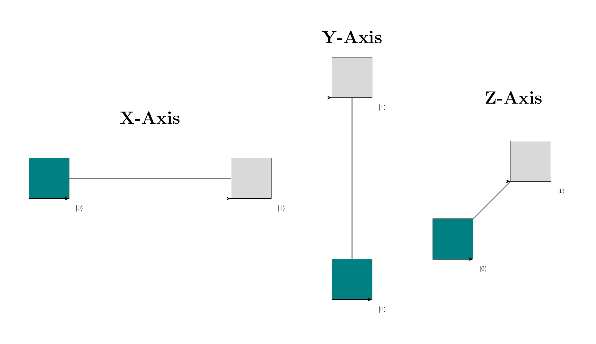

# Quantum Cube Model – LaTeX Package

Visualize quantum states and gate operations using the quantum cube model in LaTeX.

## Overview

The `quantumcubemodel` package provides simple LaTeX commands for creating intuitive cube-based diagrams to represent quantum states of 1, 2, or 3 qubits. 
Inspired by Prof. B. Just’s framework, it’s especially useful for teaching, presentations, and educational material in quantum computing.

## Breaking Changes in v0.2.0

**v0.2.0 introduces breaking changes compared to v0.1.0.**

> These changes result from a major redesign of the API to allow for more flexibility and future enhancements. 
While this means some existing code may need to be updated, the new API makes it easier to extend and customize functionality going forward.

## Features

- Draw single Coefs
- Cube diagrams for 1, 2, or 3-qubit quantum states
- Representation of complex amplitudes and phases
- Visual transitions for quantum gates:
  - Hadamard
  - Pauli-X / Y / Z
  - CNot
  - Toffoli (CCNot)
  - Wireframe (for unknown gates)
- exposing tikz canvas for extended usecases

## Running Tests

There is a Python Script that is used to generate on png per feature of this package,
and compares those against the images in `./golden` (which are manualy checked for correctnes).

> `./generate-diagrams.py`

## Generating final sty file

There is a Python Script that concats all the files in `./quantumcubemodel` into the final .sty file.
Changes to the package should be made in that dir and or the `qcmx.sty` file.

> `./build.py`

## License

MIT License
© 2025 Cedric Schacht

## Author

Cedric Schacht

[cedric.schacht@dhbw-stuttgart.de](mailto:cedric.schacht@dhbw-stuttgart.de)

[https://github.com/CedricSchacht/quantumcubemodel](https://github.com/CedricSchacht/quantumcubemodel)